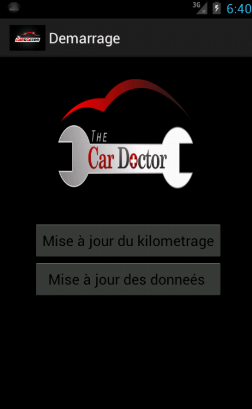
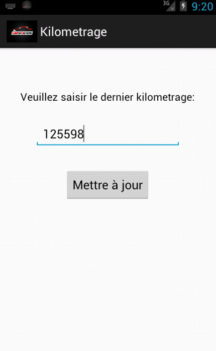
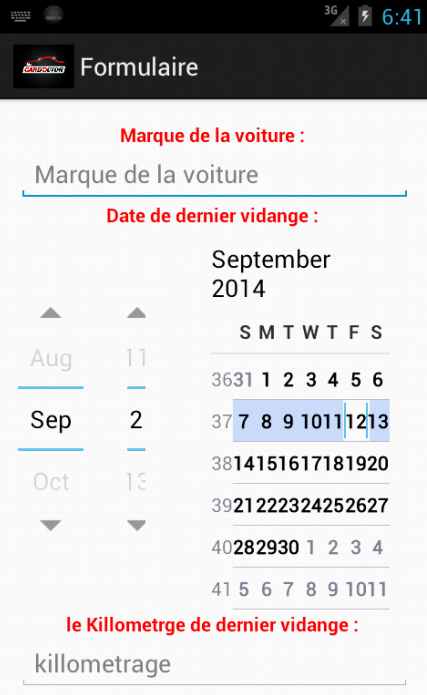
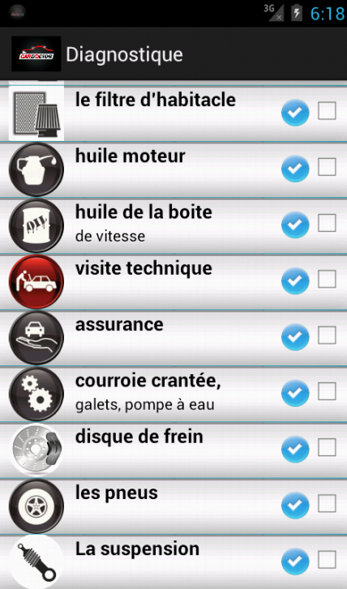
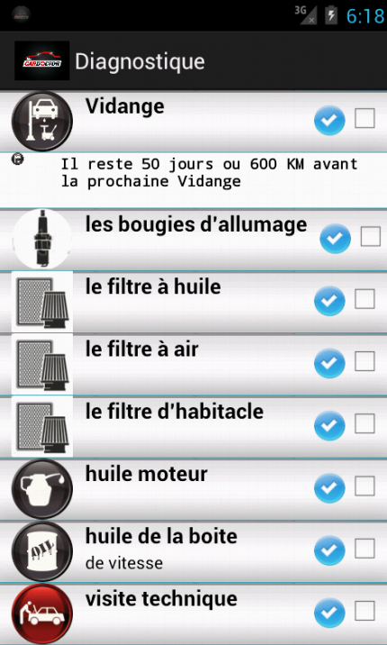
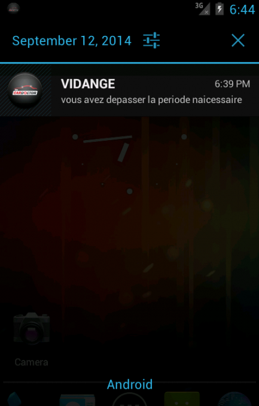

# Car Doctor app
C’est une application Android qui rappel à l’utilisateur les dates ou il doit changer les pièces de sa voiture (filtre à huile, filtre à air, huile…) en se basent sur la dernière date du changement et du nombre des kilomètres roulés. Lorsque la date du changement d’une pièce donnée est atteinte une notification s’affiche.

# Plus de détaills

# Screen Shots

